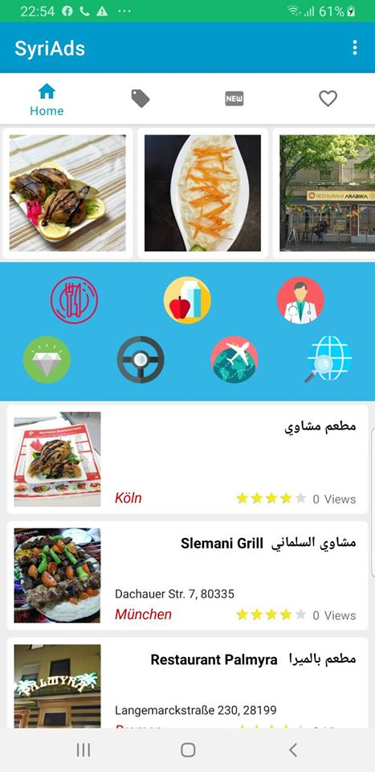
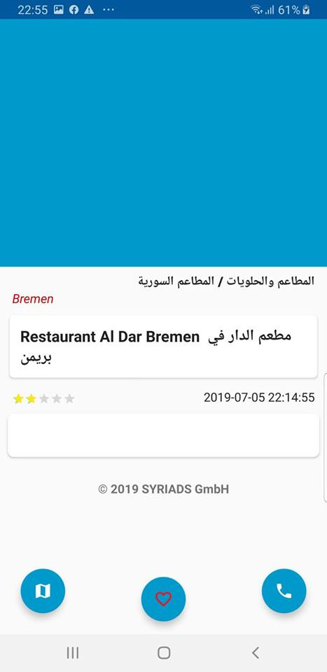
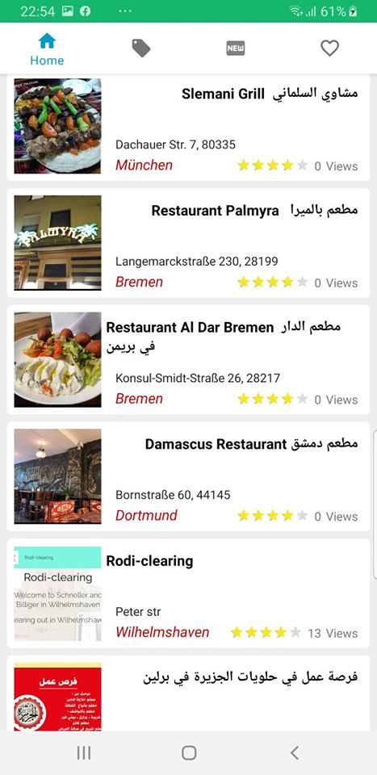

# ads-app-mvvm-dagger2
MVVM + LiveData + Room
===========================================================================================================
##Kotlin
##RxJava and RxAndroid,
##Dependency Injection with Dagger 2,
##Room Persistence Library
##Network communication with Retrofit 2,
##Image loading and caching with Glide,
##Timber,
##Espresso,
===================================================================================================================
###
###
###
###
